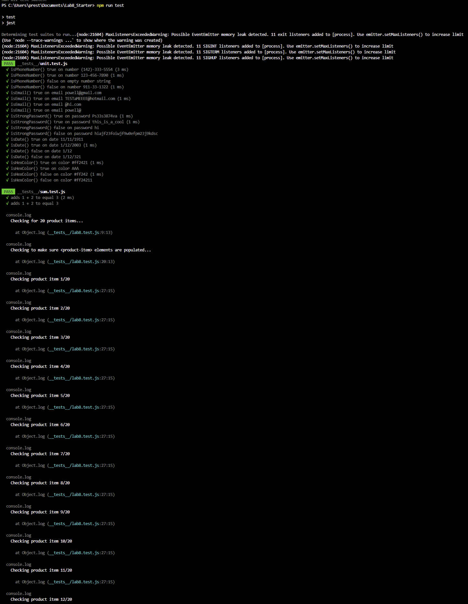
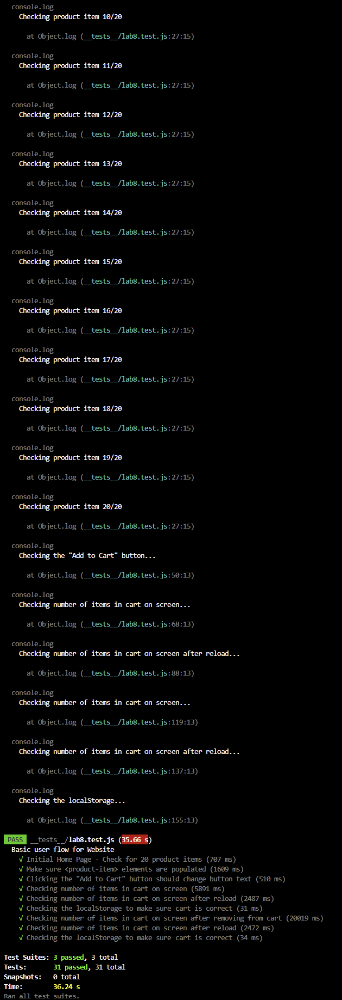

# Lab 8 - Starter
1. Within a Github action that runs whenever code is pushed 

Automated tests should be run whenever code is pushed so that it is easier to track when a potential bug is introduced. Waiting for all development could lead to a difficulty in debugging as there are a lot of potentially broken elements. Only manually running is also not optimal as it takes extra time and there is no logging of it automatically and people can forget leading to the same problem as running after all development is completed. Tests can be manually run to aid in the development process but an automatic test run is ideal to have set up.

2. Would you use an end to end test to check if a function is returning the correct output? No, that would be Unit Testing.

3. I would not use a unit test to test the "message" feature of a messaging application. The message feature likely interacts with many different components lending it more towards an end-to-end testing approach. The tests would require testing of interactions with the UI, the backend sending of the message to server, receiving of the message, and the updating of the mssage on the receiver UI.
4. I would use a unit test to test the "max message length" feature. This feature has a smaller scope and is isolated so can be tested independently with a unit test. All the test would have to do is check if input is allowed in the form of typing after 80 character limit is reached.
   
Name: Preston Yu Ellis

